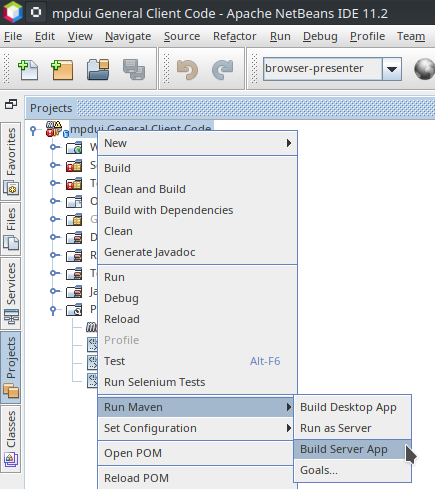

## UI for Music Player Daemon

[](https://travis-ci.org/jtulach/mpdui)

I am in desparate need to control my [MPD](https://www.musicpd.org) server
from iPad and iPhone. This is an attempt to write such UI. When at it,
I plan to make such UI portable - e.g. run it on desktop, *Android*, *iOS*
or as a server.

Don't get me wrong, [MPDroid](https://play.google.com/store/apps/details?id=com.namelessdev.mpdroid)
is great and works fine, but it just doesn't run on iOS devices, so I have
to do something...

#### Building the project

Use Maven and JDK8:

```bash
mpdui$ export JAVA_HOME=/jdk1.8.0/
mpdui$ mvn clean install -DskipTests
```

#### Building for iOS

As one needs [PR-61](https://github.com/finnyb/javampd/pull/61) which
hasn't been accepted yet, there is a Git submodule with 
custom version of `javampd` library for RoboVM (the JVM for iOS).
Build the project as described above and then:

```bash
mpdui$ mvn -f client-ios/ robovm:iphone-sim
mpdui$ mvn -f client-ios/ robovm:ios-device
```

Deploying such application to iPad device is possible, but it works just
a few days. As such I decided to try another approach...

#### Running as a server

Let's run the application on a server and display the UI in any browser.
Thanks to [Apache HTML/Java project](http://github.com/apache/netbeans-html4j)
it is just a matter of proper packaging (and a few fixes, hence a git submodule
for [html4j](http://github.com/apache/netbeans-html4j) repository).
Build the whole project as described above and then launch as:

```bash
mpdui$ mvn -f client -Pbrowser-presenter package exec:exec -Dexec.server.arg=server
```

The server starts listening on [local port 6681](http://localhost:6681). The same
can be done from NetBeans IDE:


